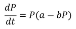
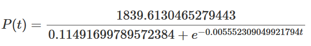
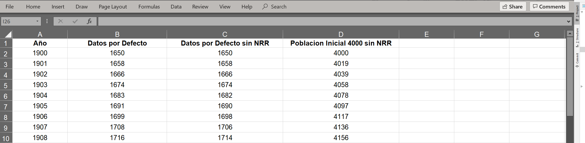
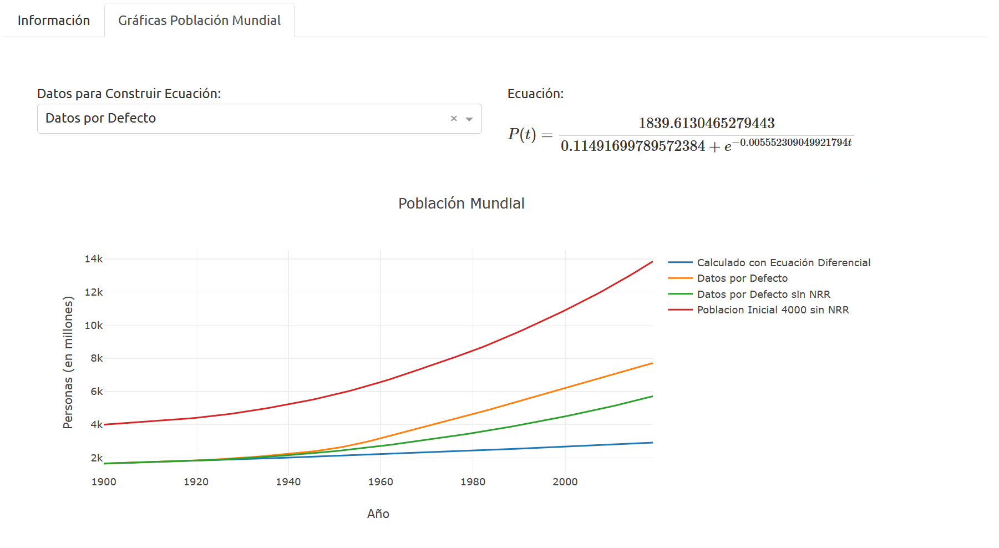

# Modelo Poblacional
<p align ="justify">
Para el curso de Ecuaciones Diferenciales de la Universidad del Valle de Guatemala, se utilizo el [Simulador de Población Mundial de Roehr (s.f.)](org), para la obtención de los datos experimentales. Recolectando el valor de población (en millones) desde el año 1900 hasta el año 2019. Y así resolver la Ecuación Lógistica:
</p>
           
<p align="center">
  </img>
</p>

Los datos utilizados para encontrar las constantes fueron: 
 * t = 0  P(0) = 1650.
 * t = 10, P(10) = 1734. 
 * t = 20, P(20) = 1833

Donde se determino la siguiente ecuacion:

<p align="center">
  </img>
</p>

# Funcionamiento Aplicación
<p align ="justify">
La fuente de datos de la aplicación es un Archivo de Excel llamado <b>data.xlsx</b>. La unica columna del archivo de Excel que no puede cambiar de nombre o eliminarse es la de "Año". Si eliminamos una de las columnas, o si agregamos una o varias columnas, el programa automáticamente tomara los datos para graficarlos y poner la información a disposición del análista para construir la ecuación diferencial del modelado de población.
</p>

<p align="center">
  <b>Imagen 1:</b> Estructura del archivo de Excel. 

  </img>
</p>


<p align="center">
  <b> Imagen 1:</b> Aplicación para construcción de la formula, a partir del set de datos seleccionado "<i>Datos para Construir Ecuación</i>". 

  </img>
</p>

## Publicación Aplicación
La aplicación puede ser vista en el siguiente [link](https://uvg-ed-modelo-poblacional.herokuapp.com/)

## Paquetes Requeridos
Los paquetes necesarios para ejecutar la aplicacion son:
* dash
* plotly
* dash_bootstrap_components
* pandas
* math
* base64

Se puede realizar la instalacion de los paquetes por medio del archivo *requirements.txt*

## Ejecutar Aplicacion


```console
$ python app.py
```

# Autores
* Pablo Sao (Ing. Bioinformática)
* Shirley Marroquín (Ing. Civil Arquitectonica)

# Referencias
* Roehr, C. (s.f.). *World Population Simulator*. Extraído de: [http://fightoverpopulation.org/](http://fightoverpopulation.org/)
* Zill, D. (2018). *Ecuaciones Diferenciales con aplicaciones de modelado*. Toluca, Ciudad de México: CENGAGE. 23 – 24 pp.
