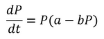

# Modelo Poblacional
Para el curso de Ecuaciones Diferenciales de la Universidad del Valle de Guatemala, se utilizo el [Simulador de Población Mundial de Roehr (s.f.)](org), para la obtención de los datos experimentales. Recolectando el valor de población (en millones) desde el año 1900 hasta el año 2019. Y así resolver la Ecuación Lógistica:

  </img>

